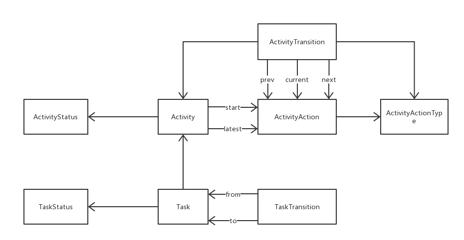

# Overview

`TODO`

# Design

## Identity Management

### Model


### Feature

Basic Features:

* User Management
    * CRUD
    * Password Management
    * bind User & Groups
    * unbind User & Groups
    * bind User & Roles
    * unbind User & Groups
* Role Management
    * CRUD
    * bind Role & Users
    * unbind Role & Users
* Group Management
    * CRUD
    * Parent & Children relationship
    * bind Group & Users
    * unbind Group & Users

Advanced Features:

* Sys Role & App Role are managed in different perspective.
* Group are managed in tree structured perspective.
* Contact are shown in different perspective
    * Group-Oriented navigator
    * List-Oriented navigator
* Show relationship everywhere
    * From user view, the binding group & role are shown.
    * From group view, the binding users are shown.
    * From role view, the binding users are shown.


## Team Collaboration

### Model




## Architecture

`TODO`

# Get Started

## Start up

Start an all-in-one sandbox by docker compose

```
docker-compose up -d
```

Check status

```
docker-compose ps
```

Now the REST APIs are all available at the port 8761 (exposed by gateway)

## Customized ENVs

key  | value | desc
---|---|---
TODO | TODO | TODO

## What's in sandbox

The services are available in sandbox.

* zuul
* eureka
* zookeeper
* kafka
* elasticsearch
* akka
* mongodb
* redis

## Scale out

The cluster is supported and it's easy to scale the API server out

```
docker-compose scale api=2
```